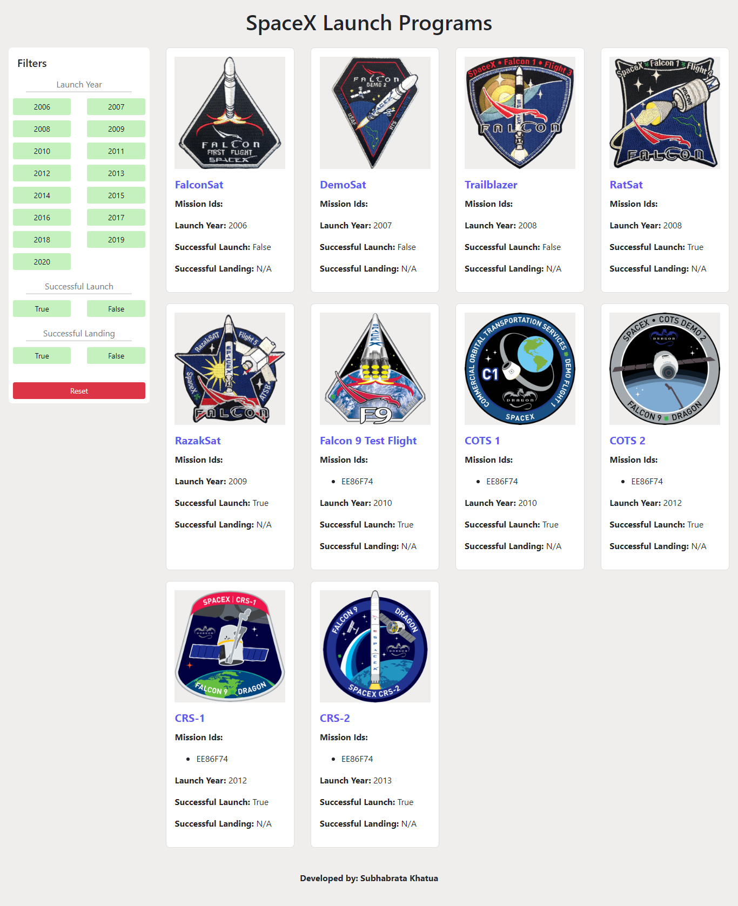
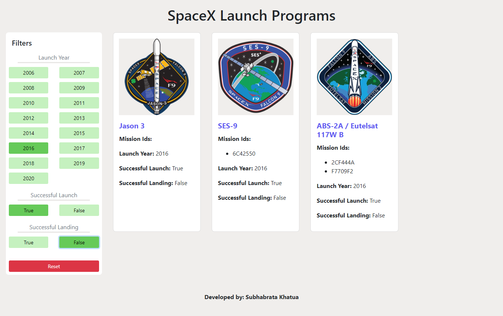
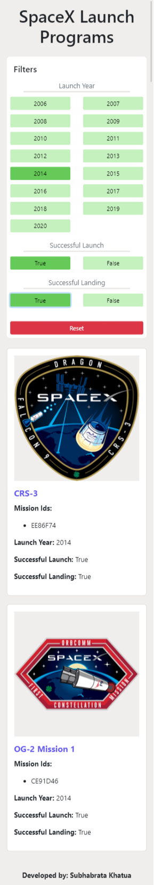
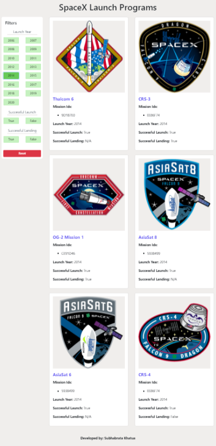

# spacex

This is a simple application to browse the Spacex launch missions, built with react and redux. You can filter the mission listing through various filters like launch year, successful launch, successful landing. You will also have reset button below the filter section to reset the filter.

I have deployed the production build of this app to the AWS ec2 instance on a node js server.

## Steps To Run The Project

1. First of all you have to install Node Js and React Js in your machine.

2. Clone the repository to your local machine.

3. Go to the project directory, then run the below command to install all dependencies:

#### `npm install`

4. Now when you are done with installing the dependencies, run the below command to run the project:

#### `npm start`

It will open the project in the browser with this url - http://localhost:3000.

## Screenshots

